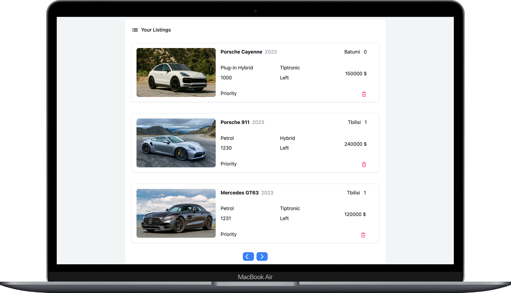

# e-auto.ge user/admin Dasbhoard 🚙

Welcome my project, a web application designed with a focus on functionality and efficiency. In this project, my primary objective was to provide users with a seamless experience in managing their car listings, authentication processes, and empower administrators with tools to oversee and moderate user activities.

🚗 Key Features:

User Authentication: This web-app ensures a secure environment by implementing user authentication, allowing users to access personalized features.
Car Listings Management: Users can effortlessly add, view, and delete their car listings, enhancing the overall user experience.
Admin Functionality: Administrators have advanced capabilities, such as checking user details, suspending or promoting users, and managing user accounts.

⚙️ Under the Hood:

Efficient Functionality over UI: Unlike traditional projects prioritizing UI, I focused on delivering stable functionality. Efforts were invested in creating an efficient caching system, server-side pagination, MERN operations and in creating reusable code for a smooth and responsive user experience.
Technology Stack: The project leverages cutting-edge technologies, including NextJS with TypeScript, tailwind & nextui for styling, mongoose as the database system, zustand for state management, next-auth for authentication, and cloudinary as a Content Delivery Network (CDN).





## How to run on your local machine

Unfortunately this project is not hosted online, so you can run it on your local machine.

```javascript
    npm run install
```

Also don't forget to add .env.local file

```javascript
MONGO_USERNAME = "";
MONGO_PASSWORD = "";
MOGNO_CLUSTER = "";
MONGO_URI = "";

NEXTAUTH_SECRET = "";
NEXTAUTH_URL = "";

NEXT_PUBLIC_CLOUDINARY_CLOUD_NAME = "";
CLOUDINARY_API_KEY = "";
CLOUDINARY_API_SECRET = "";
```

And then run this to launch app:

```javascript
    npm run dev
```

## Thank you for checking out my project. 🙂
